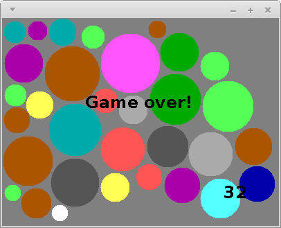

**Due: Friday, May 27th by 11:59 PM**

Acknowledgment: The idea for this assignment comes from [Tom Ellman](http://pages.vassar.edu/tomellman/) at Vassar College.

CS 201 - Assignment 2
=====================

Don't Panic!
------------

In this assignment, you are not implementing a complete game. You are just implementing one (important) class the game will use. In the next assignment you will complete the rest of the game.

Getting Started
---------------

Downlaod [CS201\_Assign02.zip](CS201_Assign02.zip). Import it into your Eclipse workspace (**File&rarr;Import&rarr;General&rarr;Existing Projects into Workspace&rarr;Archive File**.)

You should see a project called **CS201\_Assign02** in the Package Explorer.

Disk Placement Game
-------------------

In this assignment you will begin the implementation of the "Disk Placement" game. Here is a screenshot of what the completed game will look like:

> 

The goal is to place disks of random sizes and colors onto the game board so that

1.  no disk overlaps any other disk, and
2.  every disk lies entirely within the rectangular game board

The solid disks are the ones that have been successfully placed. The black disk outline follows the mouse and shows where the next disk could be placed. The number in the lower right-hand corner shows the number of disks that have been successfully placed.

The game ends when a disk is placed in a position where it overlaps another disk, or is not entirely placed within the game board:

> 

You can download my implementation of the game to see how it works:

> [disks.jar](disks.jar)

[Note: Internet explorer incorrectly renames this file to "disks.zip". You can work around this problem by downloading the file using Firefox.]

On Windows systems, just double-click on the file. On Linux and MacOS, open a terminal window, change directory into the directory in which you saved the file, and run the command

    java -jar disks.jar

Your Task
---------

Your task is to complete the implementation of the **Disk** class. (In the next assignment, you will use your **Disk** class to complete the implementation of the overall game.)

An instance of the **Disk** class represents one of the disks placed on the game board. Each **Disk** object should store **x** and **y** coordinates, a **radius**, and a color (represented as member of the **DiskColor** enumeration). You should add fields to the class for each of these 4 properties.

You must implement 7 methods:

-   A constructor which initializes the fields of a newly-created **Disk** object using values specified by parameter values
-   A **getX** method which returns the **Disk** object's x coordinate value
-   A **getY** method which returns the **Disk** object's y coordinate value
-   A **getRadius** which returns the **Disk** object's radius value
-   A **getColor** method which returns the **Disk** object's color
-   An **overlaps** method which determines whether or not the **Disk** object overlaps another **Disk** object passed as a parameter
-   An **isOutOfBounds** method which determines whether or not the **Disk** object partly or completely lies outside the bounds of the rectangular game board

Each method is described by a comment which explains, in detail, how the method should work.

A JUnit test class called **DiskTest** is provided. Make sure that all of the tests pass before you submit the completed assignment.

Hints
-----

You can compute the square root of a **double** value using the **Math.sqrt** method. For example, you can compute the distance between the centers of two **Disk** objects as follows:


Disk a = ...
Disk b = ...

double xDist = a.getX() - b.getX();
double yDist = a.getY() - b.getY();

double dist = Math.sqrt( (xDist*xDist) + (yDist*yDist) );


Submitting
----------

Export your finished program to a zip file (right-click on the project, then **Export...&rarr;Archive File**). Upload the zip file to the marmoset server as project **assign02**. The server URL is

> <https://cs.ycp.edu/marmoset>

**IMPORTANT**: after uploading, you should download a copy of your submission and double-check it to make sure that it contains the correct files. **You are responsible for making sure your submission is correct**. You may receive a grade of 0 for an incorrectly submitted assignment.
