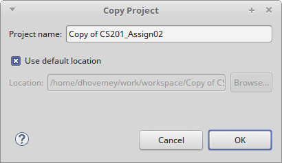
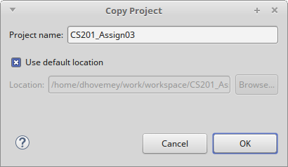
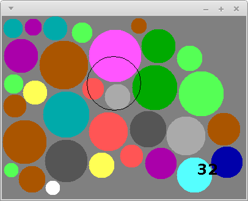
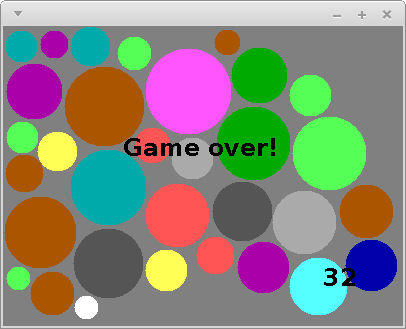

**Due**: Friday, June 3rd by 11:59 PM

Acknowledgment: The idea for this assignment comes from [Tom Ellman](http://pages.vassar.edu/tomellman/) at Vassar College.

*Update* 5/30: Added hints about representing and rendering the placed disks: see the *Disk placement* and *The paint method* sections below.

CS 201 - Assignment 3
=====================

Your Task
---------

Your task is to complete your implementation of the Disk Placement game described below.

You will use the **Disk** class you implemented in the previous assignment as an important building block in the completed game.

Getting Started
---------------

Start by making a copy of your **CS201\_Assign02** project (which you completed in the previous assignment.)

To make a copy of a project in Eclipse:

-   Right-click on the name of the project in the Package Explorer
-   Choose **Copy**
-   From the **Edit** menu, choose the **Paste** menu item

When you choose **Paste**, you will see a dialog box similar to the following one:

> 

Change the project name to **CS201\_Assign03**:

> 

Click **OK**.

Disk Placement Game
-------------------

In this assignment you will implement the "Disk Placement" game. Here is a screenshot of what the completed game will look like:

> 

The goal is to place disks of random sizes and colors onto the game board so that

1.  no disk overlaps any other disk, and
2.  every disk lies entirely within the rectangular game board

The solid disks are the ones that have been successfully placed. The black disk outline follows the mouse and shows where the next disk could be placed. The number in the lower right-hand corner shows the number of disks that have been successfully placed.

The game ends when a disk is placed in a position where it overlaps another disk, or is not entirely placed within the game board:

> 

You can download my implementation of the game to see how it works:

> [disks-obfuscated.jar](disks-obfuscated.jar)

On Windows systems, just double-click on the file. On Linux and MacOS, open a terminal window, change directory into the directory in which you saved the file, and run the command

    java -jar disks-obfuscated.jar

Specifications and Hints
------------------------

You will make all of your code changes to the **DisksPanel** class, which implements the game play.

You should add whatever fields are necessary to represent the state of the game. You will probably want to use an array of **Disk** elements to represent the disks that have been placed.

### Mouse events

The **handleMouseMove** method is called whenever the mouse pointer is moved within the window. You can get the x and y coordinates as follows:


int x = e.getX();
int y = e.getY();


where **e** is the parameter to the method, an instance of the **MouseEvent** class. You will need state variables to keep track of the current location of the mouse pointer.

The **handleMouseClick** method is called whenever a mouse button is clicked. You should use this method to place a disk in the window. You will need to check to ensure that the placed disk

1.  does not overlap any previously placed disk, and
2.  is placed entirely within the bounds of the panel

The **WIDTH** and **HEIGHT** constants provide the width and height of the panel.

Remember that you will need to call **repaint** to force the contents of the panel to be redrawn when the game state changes.

### Disk creation

When the next disk is ready to be placed, its radius should be randomly chosen in the range 10..44, inclusive. You can generate random numbers using an instance of the **java.util.Random** class as a field:


private Random rand;


Create an instance in your constructor:


rand = new Random();


You can generate a random number uniformly chosen from the range 0..n-1, inclusive, using the method call


rand.nextInt(n)


### Disk placement

The game will need to keep track of each disk that has been placed successfully.  One approach is to use an array.  For example, add the following fields to the **DisksPanel** class:


private Disk[] disks;
private int diskCount;


In the constructor:


disks = new Disk[500];
diskCount = 0;


When a disk is placed successfully, a reference to the new **Disk** object should be added to the array.  The **diskCount** field can be used to keep track of how many disks have been placed.

### The paint method

The **paint** method should use the fields representing the game state to render the current configuration.

Some **java.awt.Graphics** methods that will be useful:

-   **setColor** - Sets the drawing color.
-   **drawOval** - Draws an outlined oval. If the width and height are the same, draws an outlined circle.
-   **fillOval** - Draws a filled oval. If the width and height are the same, draws a filled circle.
-   **setFont** - Sets the current font used for drawing text.
-   **drawString** - Draws a string of text characters.

The **paint** method should draw a circle (using the appropriate color) for each disk.  If you used the approach suggested above, the **disks** array will contain references to all of the placed **Disk** objects, and the **diskCount** field will record how many there are.

Note that because the **Disk** class uses **double** values to represent coordinates and dimensions, but the methods of **java.awt.Graphics** require **int** values, you will need to use type casts to convert from **double** values to **int** values.  For example, let's say that **x**, **y**, **w**, and **h** are the coordinates and width/height of a circle you want to draw.  The call to **fillOval** would be


g.fillOval((int) x, (int) y, (int) w, (int) h);


Also note that the x/y coordinates of a disk represent its center, but the x/y coordinates in a call to **fillOval** are the upper left corner of a rectangle surrounding the oval being drawn.  You will need to adjust the disk's coordinates accordingly when drawing a disk.

Running the program
-------------------

To run the program, right-click on **DisksApp.java** and choose **Run as&rarr;Java Application**.

Grading
-------

The grading will be done as follows:

-   Displaying the outline of the next disk to be placed - 15%
-   Allowing disks to be placed, drawing them - 30%
-   Detecting overlap and out-of-bounds - 20%
-   Keeping score, displaying score - 15%
-   Detecting end of game, displaying "Game over" - 20%
-   Growing the disks array as needed, rather than preallocating a large array - 5%

Submitting
----------

Export your finished program to a zip file (right-click on the project, then **Export...&rarr;Archive File**). Upload the zip file to the marmoset server as project **assign03**. The server URL is

> <https://cs.ycp.edu/marmoset>

**IMPORTANT**: after uploading, you should download a copy of your submission and double-check it to make sure that it contains the correct files. **You are responsible for making sure your submission is correct**. You may receive a grade of 0 for an incorrectly submitted assignment.
